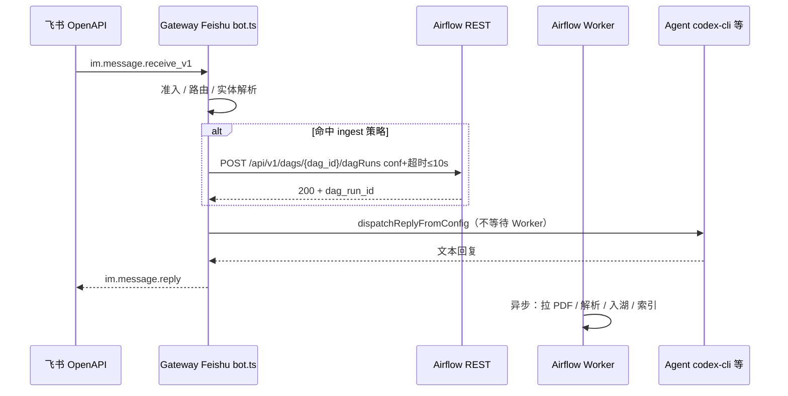
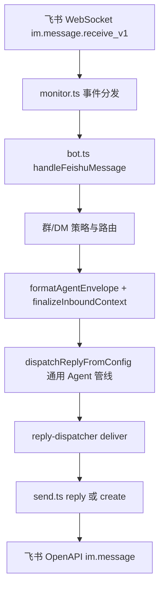

# 飞书财经入口迁移：OpenClaw Gateway 与 claw-api 对齐

本文档将「独立 `claw-feishu-bot` + 直连 `claw-api` /ask」迁移为「**OpenClaw Feishu 插件 + Gateway** 编排，**财经能力以工具调用 `claw-api`**」的执行计划；**阶段 4（可选）** 补充「飞书进线 **同步** 触发 Airflow REST、**异步** 拉 PDF / 解析 / 入湖」与主链路正交能力。关联仓库：

- **OpenClaw（本仓库）**：`extensions/feishu`、`gateway`、`auto-reply` 等。
- **claw-finance-agent**：`api/main.py`（`/ask`、爬取回退）、`feishu_bot/main.py`（独立 WebSocket Bot；**默认 compose 不启动**，见阶段 3.3）。
- **数据平台（阶段 4）**：Airflow 及 ingest DAG（仓库以贵方为准；本文仅约定 REST 契约与 Gateway 挂钩）。

---

## 背景与目标

| 现状                                                                                         | 目标                                                                                                |
| -------------------------------------------------------------------------------------------- | --------------------------------------------------------------------------------------------------- |
| `claw-feishu-bot` WebSocket 收飞书消息，HTTP 调 `claw-api` `/ask`，自建同步/异步超时与启发式 | 飞书进线走 **Gateway Feishu**，与 Discord/TG 等 **同一 inbound / agent-runner 链路**                |
| 财经 RAG/巨潮/披露逻辑仅在 `claw-api` 内                                                     | OpenClaw agent 通过 **`finance_ask`（名称可议）** 工具调用 `/ask`，可组合 workspace / skills / 记忆 |
| 双栈飞书、双份超时与「是否异步」启发式                                                       | **单一事实源**（启发式以 `claw-api` 或共享模块为准），减少漂移                                      |

---

## 阶段 1：在 OpenClaw 增加 finance 工具 + 测试会话验证 `/ask`（含爬取回退）

**目标**：在通用 agent 中可通过工具调用 `POST {CLAW_API_URL}/ask`，并在受控测试会话跑通披露、RAG、**无命中 → 巨潮爬取回退**、LLM 降级等分支。

### 任务清单

| 序号 | 任务                                                                                                         | 产出                                                                                                                  | 验收标准（DoD 子项）                                                                                                                        |
| ---- | ------------------------------------------------------------------------------------------------------------ | --------------------------------------------------------------------------------------------------------------------- | ------------------------------------------------------------------------------------------------------------------------------------------- |
| 1.1  | 调研 OpenClaw 工具注册方式（plugin manifest、`tools.allow` / `tools.alsoAllow`、`agents.list[].tools.*` 等） | 简短设计笔记：工具名、JSON schema、权限与沙箱                                                                         | 本地启动 Gateway 日志中可见工具注册                                                                                                         |
| 1.2  | 实现 **`finance_ask`（或项目约定命名）**                                                                     | 入参：`question`（必填）、可选 `use_llm`、`top_k`；`requests`/`fetch` 调 `CLAW_API_URL/ask`；超时与重试可环境变量配置 | 工具返回可解析字段含 `answer`、`used_llm`、`retrieval_status`、`disclosure_primary`；存在爬取时 `retrieval_breakdown.crawl_fallback` 可观测 |
| 1.3  | 运行与环境                                                                                                   | OpenClaw/Gateway 环境变量：`CLAW_API_URL` 等；须与**实际部署形态**一致（见下「启用与验证」）                          | 在**运行 Gateway 进程的网络命名空间**内（多为宿主机 shell）`curl` 通 `claw-api` `/health` 与 `/ask`                                         |
| 1.4  | **测试会话矩阵**（建议固定测试 agent / 测试飞书会话或 CLI）                                                  | 用例表（可附在本文件附录）                                                                                            | ① 披露类问句；②「年报 + 年份」触发爬取回退 + LLM；③ 非财报问句不误触长爬（策略与产品确认）                                                  |
| 1.5  | 观测                                                                                                         | 工具层结构化日志（trace、HTTP status、耗时）；可选对接现有 metrics                                                    | 单次调用日志可串「工具开始 → `/ask` 摘要 → 工具结束」                                                                                       |
| 1.6  | 排障文档                                                                                                     | 指向 `claw-finance-agent`：`FINANCE_ASK_TRACE`、`finance_ask` 日志前缀                                                | 值班可按文档复现                                                                                                                            |

### 阶段 1 完成定义（DoD）

在**指定测试 agent / 测试会话**中，至少 **3 条**代表性问句跑通；其中 **爬取回退** 用例须能从响应 JSON（如 `retrieval_breakdown` / `retrieval_status`）或约定答案特征证明路径已执行。

### 阶段 1 落地状态（代码已具备）

| 子项                    | 状态       | 说明                                                                                                                                                                                                                                                                                                                                                                                                                                                                                                                                                                                                                                                                                                                      |
| ----------------------- | ---------- | ------------------------------------------------------------------------------------------------------------------------------------------------------------------------------------------------------------------------------------------------------------------------------------------------------------------------------------------------------------------------------------------------------------------------------------------------------------------------------------------------------------------------------------------------------------------------------------------------------------------------------------------------------------------------------------------------------------------------- |
| 1.1–1.2 工具实现        | **已完成** | 插件目录：`extensions/claw-finance/`；**清单** `openclaw.plugin.json` 中 **`id` 为 `claw-finance`**（与 `plugins.entries.claw-finance` 一致，勿与 npm 包名 `@openclaw/claw-finance` 混淆）。入口 `index.ts` 注册 `finance_ask`；实现见 `src/finance-ask-tool.ts`（`fetch` → `POST …/ask`，超时/重试可配）。**沙箱会话不注册**（`sandboxed` 时返回 `null`）。                                                                                                                                                                                                                                                                                                                                                              |
| 1.5–1.6 观测 / 排障文档 | **已完成** | `extensions/claw-finance/src/finance-ask-tool.ts` 已固定结构化日志前缀 `finance_ask`，覆盖 `start / ok / http_retry / timeout_retry / fail`；Runbook 见 `docs/finance-ask-runbook.md`，已补 `FINANCE_ASK_TRACE`、Gateway 日志 grep、`CLAW_API_URL` / `/ask` 冒烟与常见故障对照。                                                                                                                                                                                                                                                                                                                                                                                                                                          |
| 单元测试                | **已通过** | 在仓库根执行：`pnpm exec vitest run extensions/claw-finance/src/finance-ask-tool.test.ts`                                                                                                                                                                                                                                                                                                                                                                                                                                                                                                                                                                                                                                 |
| 1.3–1.4 联调 / 测试会话 | **已完成** | 2026-04-14 已在目标宿主机验证：`plugins.entries.claw-finance.enabled=true`、顶层 `tools.allow` 含 `finance_ask`、`clawApiUrl=http://127.0.0.1:9000`；`curl http://127.0.0.1:9000/health` 返回 `{"status":"ok"}`，披露类与非财报短问的 `/ask` 直连冒烟已通过。**同日已解除测试会话 `codex-cli tools: []` 阻塞**：将当前飞书测试 DM 通过 `bindings` 精确路由到 `finance-tools` agent，模型切至 `minimax/MiniMax-M2.7`；本地 embedded 验证已看到 `finance_ask start`、`finance_ask ok`。随后在目标环境补齐了「年报 + 年份」长路径证据：`claw-api` 日志记录 `question_preview='紫金矿业2025年报'`、`stage=crawl_fallback_ok`、`source='cninfo_crawl_fallback'`，对应飞书样本已返回 `紫金矿业（601899）2025年年度报告已找到`。 |

### 启用与验证（Gateway + 测试会话）

**部署说明**：OpenClaw **Gateway 常见为宿主机进程**（`openclaw gateway` / systemd / 进程管理器），**不一定**跑在 Docker 内。下文 **`CLAW_API_URL` / `clawApiUrl` 须能被发起 `fetch` 的进程解析**：在宿主机 Gateway 上多为 `http://127.0.0.1:9000`（`claw-api` 端口映射到本机）或内网 LB；仅当 Gateway 进程跑在**与 `claw-api` 同一 Docker 网络**的容器里时，才适合写 `http://api:9000` 这类服务名。

1. **启用插件**（示例，按你方 `openclaw` 配置习惯合并）：

```yaml
plugins:
  entries:
    claw-finance:
      enabled: true
      config:
        # 宿主机 Gateway + 本机映射端口示例：http://127.0.0.1:9000
        # Gateway 容器与 claw-api 同 compose 网络时示例：http://api:9000
        clawApiUrl: "http://127.0.0.1:9000"
        # askTimeoutMs: 300000         # 可选，毫秒；默认 180000，上限 600000
```

若启用了 **`plugins.allow` 白名单**，必须把 **`claw-finance`**（以及飞书用的 **`feishu`** 等实际加载插件）一并列入，否则插件不会加载。

环境变量可选覆盖：`CLAW_API_URL` 或 `CLAW_FINANCE_API_URL`、`CLAW_FINANCE_ASK_TIMEOUT_MS`、`CLAW_FINANCE_ASK_RETRIES`。若 Gateway 在**宿主机**上跑，通常在 **systemd `Environment=`、`/etc/environment`、shell 启动脚本** 或运行前 `export` 中设置 `CLAW_API_URL`；若使用本仓库可选的 **`openclaw-gateway` Docker 服务**，也可在该服务的 `environment` 中注入（与容器内 DNS 一致）。

2. **允许 agent 调用 `finance_ask` 工具**：与 OpenClaw 当前 schema 对齐的写法包括（**同一作用域内**不要同时设置 `allow` 与 `alsoAllow`，见 [多 Agent / 工具策略](/zh-CN/tools/multi-agent-sandbox-tools)）：
   - 全局：在顶层 **`tools.allow`** 数组中列入 **`finance_ask`**；或在使用了 **`tools.profile`** 的前提下用 **`tools.alsoAllow`** 追加 `finance_ask`。
   - 按 Agent：在 **`agents.list[].tools.allow`**（或 **`agents.list[].tools.alsoAllow`**，规则同上）中为承接飞书会话的 agent 列入 `finance_ask`。

   修改后**重启 Gateway**。

3. **健康检查**（在**运行 Gateway 的同一台机器**上打开 shell，或使用与 Gateway 进程**相同路由表 / 防火墙策略**的跳板机；勿假设必须在 Docker 内执行）：

```bash
curl -sS "${CLAW_API_URL:-http://127.0.0.1:9000}/health"
```

4. **全链路冒烟（含爬取回退，耗时可能较长）**：对 `claw-api` 直接：

```bash
curl -sS --max-time 600 -X POST "${CLAW_API_URL:-http://127.0.0.1:9000}/ask" \
  -H "Content-Type: application/json" \
  -d '{"question":"紫金矿业 2025 年报","top_k":5,"use_llm":true}' | head -c 2000
```

在 **飞书/WebChat 测试会话** 中则让模型调用 **`finance_ask`**，检查返回 JSON 是否含 `retrieval_breakdown.crawl_fallback`（若该次请求触发了巨潮回退）。

5. **排障**：`claw-api` 侧可开 `FINANCE_ASK_TRACE=1`；Gateway 侧工具日志前缀为 **`finance_ask`**（见 `finance-ask-tool.ts`）。完整值班入口见 [finance-ask-runbook.md](/home/tsl/openclaw/docs/finance-ask-runbook.md)。

---

## 阶段 2：飞书生产流量从 `claw-feishu-bot` 切到 Gateway Feishu（灰度约一周）

**目标**：生产用户从「独立 Bot 直连 `claw-api`」迁到「**OpenClaw Feishu + Gateway**」；DNS/应用凭证可 **并行双跑约一周** 再全量。

### 任务清单

| 序号 | 任务                    | 产出                                                                                                                                                                        | 验收标准                                |
| ---- | ----------------------- | --------------------------------------------------------------------------------------------------------------------------------------------------------------------------- | --------------------------------------- |
| 2.1  | 盘点生产拓扑            | 文档：飞书应用 ID、事件订阅、当前谁接收 IM（`claw-feishu-bot` vs Gateway）                                                                                                  | 单一「真相表」                          |
| 2.2  | Gateway Feishu 配置对齐 | `openclaw` 配置：账号、域名、`agentId`、workspace；`tools.allow` / `tools.alsoAllow` 或 `agents.list[].tools.*` 含 **`finance_ask`**；`plugins.entries.claw-finance` 已启用 | 测试租户收消息且可调用工具              |
| 2.3  | 灰度策略                | 白名单：`open_id` / 测试群；或流量比例（若有反代）                                                                                                                          | 变更流程与负责人写明                    |
| 2.4  | DNS / 反代（若适用）    | 权重/分流、TLS、回滚开关                                                                                                                                                    | **≤5 分钟**可切回旧入口                 |
| 2.5  | 并行观察（建议 ≥7 天）  | 日报：错误率、P95、`/ask` 5xx、飞书限频、客诉                                                                                                                               | 对比 `claw-feishu-bot` 时期无未解释劣化 |
| 2.6  | Go/No-Go                | 会议纪要 + 准入指标                                                                                                                                                         | 全员签字后进入阶段 3                    |

### 阶段 2 完成定义（DoD）

**生产流量 100%** 由 Gateway Feishu 承载（或保留极小比例应急旁路且**书面**记载）；灰度期内 **无未关闭 P1**。

### 阶段 2 配置片段（合并思路，非完整 openclaw.json）

以下用 **JSON5** 示意「飞书进线 + 财经工具」常与其它键共存，请按你方现有配置合并，避免覆盖未列出的必填项。

```json5
{
  plugins: {
    // 若使用 allow 白名单，需包含实际要加载的每一个插件 id
    // allow: ["feishu", "claw-finance"],
    entries: {
      feishu: { enabled: true },
      "claw-finance": {
        enabled: true,
        config: { clawApiUrl: "http://api:9000" },
      },
    },
  },
  channels: {
    feishu: {
      // appId / appSecret / encryptKey 等见官方飞书渠道文档
      enabled: true,
    },
  },
  agents: {
    list: [
      {
        id: "finance-feishu", // 示例：飞书路由到的 agent id，以你方 routing 为准
        tools: {
          // 在已使用 tools.profile / 全局默认工具集时，用 alsoAllow 追加（勿与 tools.allow 同对象并用）
          alsoAllow: ["finance_ask"],
        },
      },
    ],
  },
}
```

飞书路由（哪个会话走哪个 `agentId`）见 [渠道路由](/zh-CN/channels/channel-routing)。安装 Feishu 插件与权限清单见 [飞书渠道文档](/zh-CN/channels/feishu)。

### 与 `claw-finance-agent` Compose 共存

- **独立 `feishu-bot`**：`claw-finance-agent` 仓库内默认 **`docker compose up` 不启动** `feishu-bot`；本地仍要对照旧链路时：`docker compose --profile standalone-feishu-bot up -d feishu-bot`。也可在 shell 导出 **`COMPOSE_PROFILES=standalone-feishu-bot`** 再 `up`，等价于常驻 profile。
- **Gateway（宿主机进程）→ `claw-api`（常见为 Docker）**：`clawApiUrl` / **`CLAW_API_URL`** 须是 **Gateway 进程所在主机上可解析且可连通的地址**。典型写法：`http://127.0.0.1:9000`（已将 `claw-api` 的 `9000` 映射到宿主机）、或 `http://<内网 IP>:9000`。若 `claw-api` **仅**在 bridge 内监听、未发布端口，则需 **发布端口** 或让 Gateway 经 **同机 Docker 网关 / 用户定义网络** 能路由到该容器（具体以运维网络为准）。
- **Gateway（容器内进程）→ `claw-api`**：此时才使用 **`http://api:9000`** 等与 `claw-api` **同一 Docker 网络**上的服务名；跨 compose 时可用 **`http://host.docker.internal:9000`**（映射到宿主机再进发布端口）或 **external network** 互联。避免在容器内写 `127.0.0.1:9000` 却指向容器自身而非宿主机映射。

---

## 阶段 3：删除 `feishu_bot` 内与启发式、超时重复的逻辑

**前提（理想顺序）**：阶段 2 稳定后收敛最稳妥。**代码侧 3.1 已合并**时，请确保主流量或值班路径已接受「单次长等待回复」或已迁 **Gateway**；应急可回滚 `feishu-bot` 镜像 tag。

### 任务清单

| 序号 | 任务         | 产出                                                                                                                                                                           | 验收标准                        |
| ---- | ------------ | ------------------------------------------------------------------------------------------------------------------------------------------------------------------------------ | ------------------------------- |
| 3.1  | 对照删除     | 移除：`feishu_bot/main.py` 中 `_needs_async_finance_response`、`FEISHU_ASYNC_*` 分支、`CreateMessage` 第二条跟进；`claw-finance-agent/docker-compose.yml` 中对应 `environment` | 代码与 compose 无死配置         |
| 3.2  | 能力迁移确认 | 独立 `feishu-bot` 已改为**单次 Reply + 长超时**；若仍需「先确认再全文」：在 OpenClaw Gateway 用 **工具状态 / 队列** 或渠道层能力实现                                           | 主流量走 Gateway 时体感可接受   |
| 3.3  | 服务形态决策 | **`feishu-bot` 使用 compose profile `standalone-feishu-bot`**：默认 `docker compose up` **不**拉起；应急见下文 3.3                                                             | `docker compose` 与运维手册一致 |
| 3.4  | 回归         | 飞书：短/长问句、财报、非财报；监控 24h                                                                                                                                        | 无回归单                        |
| 3.5  | 归档         | 本文件或 CHANGELOG 记录退役日期                                                                                                                                                | 新人可追溯                      |

### 阶段 3 代码对照与落地（`claw-finance-agent` 仓库）

**3.1 代码与 compose 已实施**（`claw-finance-agent`）：已删除 `_needs_async_finance_response`、`FEISHU_ASYNC_*` 双段投递、`CreateMessage` 主动第二条；仅保留 **WebSocket 后台线程 + `ReplyMessage` 单次回复**。

| 环境变量（新）           | 含义                           | 默认    |
| ------------------------ | ------------------------------ | ------- |
| `FEISHU_ASK_TIMEOUT`     | `POST /ask` 读超时（秒）       | `600`   |
| `FEISHU_REPLY_MAX_CHARS` | 单条回复正文上限（防飞书拒收） | `12000` |

**已废弃**（请从 `.env` / 编排中删除）：`FEISHU_ASYNC_ASK`、`FEISHU_ASYNC_ASK_TIMEOUT`、`FEISHU_ASYNC_MESSAGE_MAX_CHARS`。

**运维注意**：独立 `feishu-bot` 不再先发「已收到」占位；长问句用户需等待同一条回复直至超时或完成。主生产若已迁 **OpenClaw Gateway**，优先用 **`finance_ask`** 与网关侧体验策略。

**3.3 服务形态（已默认关闭独立 Bot）**：`claw-finance-agent/docker-compose.yml` 中 **`feishu-bot` 已配置 `profiles: [standalone-feishu-bot]`**，plain `docker compose up` **不会**创建该容器。需要独立 WebSocket 应急时：

```bash
docker compose --profile standalone-feishu-bot up -d feishu-bot
```

不再需要时停掉：`docker compose --profile standalone-feishu-bot stop feishu-bot`（或 `down` 时带同一 `--profile`）。若永久退役，可从 compose **删除** `feishu-bot` 整段。

**3.4 回归清单（飞书 / Gateway，上线前勾选）**

- [ ] 短问句：同步回复、无异常日志
- [ ] 披露类问句：`disclosure_*` 或答案语义正常
- [ ] 长爬 + LLM 问句：未早于 `FEISHU_ASK_TIMEOUT` 误杀；超时提示可读
- [ ] **Gateway 路径**：`finance_ask` 在 `tools.alsoAllow` / `allow` 中生效，`CLAW_API_URL` 可达
- [ ] 24h 内错误率、飞书限频无异常（与灰度指标对齐）

**3.5 归档**：见下文「文档维护 → 变更记录」。

### 阶段 3 完成定义（DoD）

`feishu_bot` **不再包含**与 OpenClaw 已覆盖的 **启发式 / HTTP 超时 / 双段投递** 重复逻辑；部署与文档一致。

---

## 横切项（一至四阶段）

- **回滚**：每阶段保留上一版镜像 tag 与 compose override；阶段 2 必须可 **一键回切** `claw-feishu-bot`（`docker compose --profile standalone-feishu-bot up -d feishu-bot`，并恢复飞书事件订阅指向旧入口）。
- **安全**：工具层对 `finance_ask` 做 **速率/并发** 限制；提示词与 workspace 规则（如 `clawd/AGENTS.md`）禁止向用户复述内网流水。
- **单一事实源**：「何时易触发长爬」最终以 **`claw-api`** 或共享库为准；OpenClaw 侧避免再维护一套重复正则（阶段 3 完成后真正消除重复）。
- **阶段 4（若启用）**：Airflow 凭证与 RBAC、DAG 版本回滚纳入变更评审；见 **阶段 4** 任务清单与 DoD。

---

## 阶段 4（可选）：飞书进线触发 Airflow REST 异步入湖（同步发起、异步执行）

**目标**：飞书消息经 Gateway 进线并命中约定策略时，在 **不阻塞** PDF 解析与入湖的前提下，**同步**调用 Airflow REST **`POST /api/v1/dags/{dag_id}/dagRuns`** 提交一次 DAG Run；Worker **异步**完成巨潮（或其它来源）PDF 拉取、解析、写入数据湖/对象存储及索引更新。与飞书事件超时、Gateway 单次处理超时兼容。

**前提（建议顺序）**：**阶段 2** 已在测试或生产环境走通 Gateway Feishu 进线；Airflow 集群、目标 **`dag_id`**、网络路由与鉴权已就绪。**可与阶段 1 并行在测试环境验证**；不替代 `finance_ask` / `/ask` 问答能力。

**与阶段 1 的关系（必读）**

| 能力                      | 典型触发                                                         | 说明                                                                                                                                                                                                                       |
| ------------------------- | ---------------------------------------------------------------- | -------------------------------------------------------------------------------------------------------------------------------------------------------------------------------------------------------------------------- |
| **`finance_ask`**         | 模型在 **非 CLI** 路径下调用工具                                 | 见阶段 1；`POST {CLAW_API_URL}/ask`，RAG / 爬取回退等。                                                                                                                                                                    |
| **阶段 4 Airflow ingest** | **Gateway（或紧贴进线的旁路服务）** 在解析用户意图后调用 Airflow | **不依赖** `codex-cli` / `claude-cli`：CLI 路径下 `runCliAgent` 固定 **`tools: []`**，模型无法通过 OpenClaw 工具触发入湖；须在 **`dispatchReplyFromConfig` 之前**（或与 Agent **并行**且 **短超时**）完成 `dagRuns` 提交。 |

两者可并存：**ingest 提升数据湖新鲜度**；**`/ask` 承担问答与检索**（索引未刷新前，答案仍可能基于旧切片，产品需定义预期）。

### 任务清单

| 序号 | 任务                                      | 产出                                                                                                           | 验收标准（DoD 子项）                                                                                  |
| ---- | ----------------------------------------- | -------------------------------------------------------------------------------------------------------------- | ----------------------------------------------------------------------------------------------------- |
| 4.1  | 数据工程：目标 DAG 与 `dag_run.conf` 契约 | DAG 读取 `conf`（`idempotency_key`、`ts_code`、`fiscal_year`、`report_type`、`trigger_source` 等）；首节点幂等 | 同一 `idempotency_key` 重跑不重复全量拉取或 **快速 no-op**；Airflow UI 可见 `conf`                    |
| 4.2  | 网络与鉴权                                | 自 **Gateway 进程所在主机** 到 `AIRFLOW_URL` 路由、防火墙、TLS；服务账号或 OAuth                               | 与生产同视角的 `curl --max-time 8` 手工触发 **2xx**；密钥仅存密钥管理 / 环境注入，**不进** Git        |
| 4.3  | Gateway：意图与实体解析                   | 规则表 / 轻量服务输出证券代码、报告期等                                                                        | 经产品确认的**测试集**（建议 ≥10 条）命中率、误触发率书面达标                                         |
| 4.4  | Gateway：`POST dagRuns` 集成              | 配置项：`AIRFLOW_URL`、`DAG_ID`、超时毫秒、开关、可选灰度 `open_id` 列表；实现位置见下文「挂钩位置」           | **发起调用** P95 **小于**配置上限（建议 3～10s）；**4xx/5xx 不阻塞** 用户侧 Agent 回复（降级 + 日志） |
| 4.5  | 可观测与告警                              | 结构化日志（如 `airflow_dag_run_enqueued`）、指标、可选对接现有监控                                            | 可按 `feishu message_id` 串联到 `dag_run_id`；失败有告警与 Runbook 条目                               |
| 4.6  | 滥用治理                                  | 每用户/每会话 QPS、全局日预算、白名单                                                                          | 压测下 Airflow 队列深度在约定上限内；误触发可快速关开关                                               |
| 4.7  | 文档与交付                                | Runbook：启停、回滚 DAG、密钥轮换                                                                              | 值班可独立执行；本表 DoD 已勾选                                                                       |

### 阶段 4 完成定义（DoD）

- **测试租户**：不少于 **5 条**经产品确认的飞书原文（含正负例：应触发 / 不应触发），每条在 Gateway 侧可观测到 **提交成功**（HTTP **2xx**）或 **符合预期的有意跳过**（并记日志）。
- **Airflow**：对应 `dag_run` 在约定 SLA 内达到 **success**（若业务仅要求「提交即完成」，须在 DoD 中书面降级为「仅验证 REST 2xx」并由数据负责人签字）。
- **性能**：开启阶段 4 后，飞书进线 **首包可感知延迟** 相对关闭时增幅 **不超过** SRE 与产品联合签字阈值（建议单独记录 P95/P99）。
- **安全与合规**：`conf` 中无密钥；审计字段 `trigger_source` 齐全。

**当前灰度性能留样（2026-04-14）**：基于 Gateway 结构化日志中 `airflow_dag_run_enqueued` 的 **7** 条样本，`latency_ms` 实测 **min=199ms / avg=235.57ms / p50=232ms / p95=261ms / max=261ms**，明显低于当前 `channels.feishu.airflowIngest.timeoutMs=8000` 的配置上限。该结果可作为后续 **SRE / 产品签字** 的性能底稿，但尚未替代正式签字。

### OpenClaw 侧实现与配置（本仓库）

| 子项               | 状态         | 说明                                                                                                                                                                                                                                                                                                                                                                                 |
| ------------------ | ------------ | ------------------------------------------------------------------------------------------------------------------------------------------------------------------------------------------------------------------------------------------------------------------------------------------------------------------------------------------------------------------------------------ |
| 4.3 意图与实体解析 | **部分完成** | `extensions/feishu/src/airflow-ingest.ts` 已具备 `filingKeywords`、6 位代码解析、`stockAliases`、外置 A 股别名字典 `$include` 与 `preview` 诊断日志；`claw-finance-agent` 已补 `scripts/refresh_openclaw_a_share_aliases.py`、`scripts/refresh_openclaw_a_share_aliases_and_reload.sh`、自动刷新 timer。剩余缺口是把**产品确认测试集（建议 ≥10 条）**与命中率/误触发率书面结论补齐。 |
| 4.4 Gateway 集成   | **已完成**   | `extensions/feishu/src/airflow-ingest.ts`：`maybeTriggerAirflowIngest`；`extensions/feishu/src/bot.ts` 在 **`dispatchReplyFromConfig` 之前** `await` 调用（失败仅 `error` 日志，**不**阻断进线）。Schema：`extensions/feishu/src/config-schema.ts` 中 **`channels.feishu.airflowIngest`**（账号合并配置与顶层一致）。                                                                |
| 4.5 可观测与告警   | **部分完成** | 结构化日志已覆盖 `airflow_dag_run_enqueued`、`duplicate`、`no ts_code`、失败与异常，成功日志可串 `message_id -> dag_run_id -> idempotency_key`；`claw-finance-agent` 已补 `scripts/trace_feishu_airflow_message.sh`、`scripts/verify_openclaw_a_share_aliases_timer.sh`。剩余缺口是把**告警接线 / 值班告警出口**写成正式 Runbook 并纳入日常值班。                                    |
| 4.6 滥用治理       | **已完成**   | `extensions/feishu/src/airflow-ingest.ts` 已补 `allowFrom` 白名单、单 sender 窗口限流、单账号全局窗口限流，以及基于 `feishu_message_id + dag_id + ts_code + fiscal_year` 的短期去重；`extensions/feishu/src/config-schema.ts` 已声明对应配置项；超过阈值或命中重复仅记 `skipped` 日志，不阻断主回复链路。                                                                            |
| 4.7 文档与交付     | **部分完成** | 本文档已补配置、`EnvironmentFile`、追踪命令、别名字典维护、一键刷新/按变更重载、自动刷新 timer 与巡检入口。剩余缺口是把**阶段 4 验证记录表、里程碑日期与 DoD 结论**补齐，并补完值班告警收口。                                                                                                                                                                                        |
| 单元测试           | **已通过**   | 仓库根：`pnpm exec vitest run extensions/feishu/src/airflow-ingest.test.ts`                                                                                                                                                                                                                                                                                                          |

**`channels.feishu.airflowIngest` 配置示例（JSON5）**

```json5
{
  channels: {
    feishu: {
      airflowIngest: {
        enabled: true,
        baseUrl: "https://airflow.example.com",
        dagId: "ingest_cninfo_pdf",
        timeoutMs: 8000,
        // 可选：覆盖默认触发词列表
        // filingKeywords: ["年报", "财报", "年度报告"],
        // 可选：sender_open_id 白名单；配置后仅允许命中的发送者触发
        // allowFrom: ["ou_xxx", "ou_yyy"],
        // 可选：简称 → ts_code（推荐用外置 include 文件维护，减少误解析）
        stockAliases: {
          $include: "./feishu-airflow-stock-aliases.a-share.json",
        },
        // 可选：写入 conf.report_type，由 DAG 解释
        // reportType: "annual",
        // 可选：窗口限流，默认 60s / 每 sender 5 次 / 每账号 30 次
        // rateLimitWindowMs: 60000,
        // rateLimitMaxPerSender: 5,
        // rateLimitMaxGlobal: 30,
        // 可选：同一消息短期去重窗口，默认 10 分钟
        // dedupeTtlMs: 600000,
        // 可选：Basic 用户名（密码必须用环境变量，勿写进文件）
        // username: "openclaw_feishu",
      },
    },
  },
}
```

**A 股简称字典维护（推荐）**

建议不要在 `openclaw.json` 里手工维护几千条简称。当前可直接复用 `claw-finance-agent` 的 `data/company_list/a_share_list.json` 生成外置字典：

```bash
cd /home/tsl/claw-finance-agent
./.venv/bin/python scripts/refresh_openclaw_a_share_aliases.py
systemctl --user restart openclaw-gateway
```

若希望按运维口径一键完成“生成 -> 比较 -> 仅变更时覆盖并重启 Gateway”，推荐直接使用：

```bash
cd /home/tsl/claw-finance-agent
bash scripts/refresh_openclaw_a_share_aliases_and_reload.sh
```

默认输出文件为 `~/.openclaw/feishu-airflow-stock-aliases.a-share.json`，`openclaw.json` 通过 `$include` 引用即可。若需要先刷新全量 A 股清单，再执行：

```bash
cd /home/tsl/claw-finance-agent
./.venv/bin/python scripts/refresh_openclaw_a_share_aliases.py --refresh-source
systemctl --user restart openclaw-gateway
```

对应的一键入口也支持 `--refresh-source`：

```bash
cd /home/tsl/claw-finance-agent
bash scripts/refresh_openclaw_a_share_aliases_and_reload.sh --refresh-source
```

若希望自动刷新，当前仓库已提供 user systemd timer 安装脚本：

```bash
cd /home/tsl/claw-finance-agent
bash scripts/install_openclaw_a_share_aliases_timer.sh
```

默认会安装并启用：

- `openclaw-a-share-aliases-refresh.service`
- `openclaw-a-share-aliases-refresh.timer`

默认调度为每天 `06:30`，带 `15m` 随机延迟，任务内容为：

- 使用 `--refresh-source` 拉取最新 A 股清单
- 重新生成 `~/.openclaw/feishu-airflow-stock-aliases.a-share.json`
- 仅在字典变化时重启 `openclaw-gateway`

安装后可用以下入口做巡检：

```bash
cd /home/tsl/claw-finance-agent
bash scripts/verify_openclaw_a_share_aliases_timer.sh
```

**环境变量（必填方可真正发起请求）**

| 变量                               | 说明                                                       |
| ---------------------------------- | ---------------------------------------------------------- |
| `OPENCLAW_FEISHU_AIRFLOW_USERNAME` | Basic 用户名（可省略若已在 `airflowIngest.username` 配置） |
| `OPENCLAW_FEISHU_AIRFLOW_PASSWORD` | Basic 密码（**仅**环境注入）                               |

**systemd 用户单元（推荐：不写进 `openclaw.json`）**

在用户单元 **`~/.config/systemd/user/openclaw-gateway.service`** 中增加一行（已在本仓库运维机示例中采用 **`EnvironmentFile=-`**，文件缺失不失败）：

```ini
EnvironmentFile=-/home/tsl/.openclaw/feishu-airflow.env
```

在 **`~/.openclaw/feishu-airflow.env`** 写入（**无** `export` 前缀，一行一个键值）：

```bash
OPENCLAW_FEISHU_AIRFLOW_USERNAME=你的Airflow用户
OPENCLAW_FEISHU_AIRFLOW_PASSWORD=你的Airflow密码
```

然后：

```bash
chmod 600 ~/.openclaw/feishu-airflow.env
systemctl --user daemon-reload
systemctl --user restart openclaw-gateway
```

若 Gateway **并非**由上述 user unit 托管（例如由交互式 shell / 其它父进程拉起），则需在**同一启动环境**中 `export` 上述变量，或 `set -a && source ~/.openclaw/feishu-airflow.env && set +a` 后再启动 `openclaw gateway`。

**`dag_run.conf` 实际字段（与 DAG 契约对齐）**：`idempotency_key`、`trigger_source`（固定 **`openclaw_gateway_feishu`**）、`ts_code`、`feishu_message_id`、`sender_open_id`、可选 `fiscal_year`、`report_type`（来自配置）、`raw_question_preview`（截断正文）。

**触发规则（当前实现）**：正文包含 **`filingKeywords` 之一**（未配置则用内置：年报、财报、巨潮、披露等），且能解析 **`ts_code`**（优先 **`stockAliases`** 简称命中，否则 **6 位代码**可选 `.SH/.SZ`；无后缀时 `6` 开头默认 `.SH`，否则 `.SZ`）时进入触发判定。若配置了 **`allowFrom`**，则仅白名单 `sender_open_id` 可继续；随后应用短期去重（默认 **10 分钟**，同一消息重复投递只提交一次）与窗口限流（默认 **60s / 每 sender 5 次 / 每账号 30 次**），命中重复或超限仅记 `skipped` 日志，不阻断主回复链路。成功、失败与关键跳过日志均携带 `message_id`、`dag_run_id` / `idempotency_key` 或正文预览，便于串联排障。

### 设计细节：时序与超时原则

- **同步边界（Gateway / 钩子内）**：仅包含「鉴权 + `POST dagRuns` + 解析 JSON 拿到 `dag_run_id`（或 4xx/5xx 处理）」，目标耗时 **通常 1～3 秒级，建议 HTTP 客户端超时 3～10 秒**。
- **异步边界（Airflow Worker）**：下载巨潮 PDF、解析、写入对象存储/数仓、向量索引等，**分钟级**可接受；**不得**阻塞飞书 WebSocket 回调线程过久（若钩子与 WS 同线程，尤须非阻塞或极短超时）。
- **产品预期**：提交成功后用户侧可仍只看到 `codex-cli` 文本回复；除非另做「任务已排队」提示，否则勿假设「下一轮 `/ask` 已读到新索引」。

### Airflow REST（2.x）提交 DAG Run

官方 REST 参考：[Trigger DAG Run](https://airflow.apache.org/docs/apache-airflow/stable/stable-rest-api-ref.html#operation/post_dag_run)（路径以集群版本为准，常见为 **`POST /api/v1/dags/{dag_id}/dagRuns`**）。

**请求要点**

- **鉴权**：按集群配置使用 **Basic**（用户名密码）或 **JWT/OAuth**（Airflow 2.7+ 常见）；禁止把长期令牌写进飞书可见的日志。
- **Body**：至少包含 `dag_run_id`（可选，不传则由服务端生成）与 **`conf`**（JSON 对象，传给 DAG 的 `dag_run.conf`）。
- **`conf` 建议字段**（与数据工程对齐即可）：

| 字段                              | 说明                                                                              |
| --------------------------------- | --------------------------------------------------------------------------------- |
| `idempotency_key`                 | 如 `sha256(feishu_message_id + 规范化意图)`，DAG 首任务据此 **skip** 重复全量拉取 |
| `trigger_source`                  | 实现为固定 **`openclaw_gateway_feishu`**（可与 DAG 约定其它枚举）                 |
| `ts_code` / `symbol` / `sec_name` | 证券解析结果（由 Gateway 侧轻量规则或独立 NER 服务产出）                          |
| `fiscal_year` / `report_type`     | 如 `2025`、`annual`                                                               |
| `raw_question_preview`            | 截断后的用户原文（可选，供排障，注意脱敏）                                        |

**示例（占位符，勿在生产照抄密钥）**

```bash
# 仅演示「同步发起」；DAG 内再异步执行拉 PDF / 解析 / 入湖
AIRFLOW_URL="https://airflow.example.com"
DAG_ID="ingest_cninfo_pdf"

curl -sS --max-time 8 -X POST "${AIRFLOW_URL}/api/v1/dags/${DAG_ID}/dagRuns" \
  -u "${AIRFLOW_USER}:${AIRFLOW_PASSWORD}" \
  -H "Content-Type: application/json" \
  -d '{
    "dag_run_id": "feishu_ingest_manual_optional",
    "conf": {
      "trigger_source": "feishu",
      "idempotency_key": "sha256:REPLACE_ME",
      "ts_code": "000977.SZ",
      "fiscal_year": 2025,
      "report_type": "annual"
    }
  }'
```

成功时 HTTP **200**，响应体含 **`dag_run_id`**（若请求里未指定则由服务端生成）；失败时根据 **409**（冲突）、**4xx/5xx** 打指标并 **降级**（仍放行 Agent 回复，避免用户无响应）。

### 在 OpenClaw 中的挂钩位置（实现指引）

与附录「**飞书消息处理链路**」对齐，推荐在 **`handleFeishuMessage` 已通过准入与路由、且已得到规范化 `messageBody` / `sessionKey` 之后**，**调用 `dispatchReplyFromConfig` 之前**（或与其 **`Promise.all` 非阻塞并行**，但须限制并发与超时）插入：

1. 轻量 **意图/实体解析**（规则优先，避免依赖 `codex-cli` 输出）。
2. 命中「公告 / 年报 / 财报 + 标的 + 年份」等策略时 → **上述 `POST …/dagRuns`**。
3. 可选：将 `dag_run_id` 或「已排队」**追加到 `extraSystemPrompt` / 首条上下文**（若该通道仍用 CLI，仅作文本提示，**不是**工具调用）。

实现位置：**`extensions/feishu/src/bot.ts`**（`handleFeishuMessage` 内主进线、`dispatchReplyFromConfig` 前）、**`extensions/feishu/src/airflow-ingest.ts`**。另见附录 `monitor.ts` 事件入口；改动前评估 **飞书事件重复投递** 与 **幂等**（`idempotency_key` 已下发，DAG 内须消费）。

### 风险与治理

- **滥用**：每条消息都触发 DAG → 成本与 Airflow 队列堆积；需 **频率限制、白名单、置信度阈值**。
- **幂等**：同一 `message_id` 重试飞书事件时，DAG 内须 **可安全重跑或快速 no-op**。
- **安全**：`conf` 勿带密钥；Airflow 账号权限 **最小化**（仅能触发指定 `dag_id` 若平台支持 RBAC）。
- **可观测**：Gateway 打结构化日志 `airflow_dag_run_enqueued dag_id=… dag_run_id=… message_id=… idempotency_key=… latency_ms=…`；Airflow 侧用标准任务日志关联 `idempotency_key`。

### 值班排障命令（灰度 / 生产共用）

已知 `message_id` 时，先看 Gateway 是否真正 enqueue，是否命中去重或失败：

```bash
journalctl --user -u openclaw-gateway --since "15 minutes ago" --no-pager \
  | grep 'om_xxxxxxxxxxxxxxxxxxxxxxxxxxxxxxxx'
```

期望至少出现以下之一：

- `airflow_dag_run_enqueued ... message_id=... dag_run_id=...`
- `airflow ingest skipped (duplicate message_id=...)`
- `airflow ingest skipped (no ts_code from text message_id=... preview=...)`
- `airflow ingest failed ... message_id=...`

再到 Airflow 查最近运行：

```bash
cd /home/tsl/claw-finance-agent
docker compose exec -T airflow-scheduler airflow dags list-runs -d ingest_cninfo_pdf --no-backfill | tail -n 20
```

若需要把消息与 DAG 落盘副作用对上，可继续查落盘目录：

```bash
cd /home/tsl/claw-finance-agent
find phase4_airflow/logs/phase4_data/openclaw_ingest -type f | tail -n 20
```

### 流程示意（Mermaid）



---

## 目标环境：阶段 1 DoD 联调 + 阶段 2 灰度与签字

> **说明**：本节为在**贵方目标环境**执行的检查表与签字模板，须由现场责任人操作并填写日期/姓名/证据链接；**无法**在通用代码仓库内代为完成联调或获取具有法律效力的签字。

### 前置条件（启动联调前勾选）

- [x] Gateway 与 `claw-api` 已部署，且在 **运行 Gateway 的宿主机（或与 Gateway 同网络视角的跳板机）** 上 `curl` 可达 **`CLAW_API_URL` / `clawApiUrl`**（2026-04-14 宿主机实测：`http://127.0.0.1:9000/health -> {"status":"ok"}`）。
- [x] `plugins.entries.claw-finance.enabled: true`，`plugins.allow`（若有）含 `claw-finance` 与 `feishu`（2026-04-14 实测：`claw-finance.enabled=true`，顶层 `tools.allow` 含 `finance_ask`）。
- [x] 承接飞书测试会话的 agent 已配置 `finance_ask`（`tools.allow` 或 `tools.alsoAllow` 等，与 profile 策略一致）。2026-04-14 已为当前飞书测试 DM 增加 `bindings`：`feishu/direct/ou_b3afb7d2133e4d689be523fc48f3d2b3 -> finance-tools`，路由解析结果为 `agent:finance-tools:feishu:direct:ou_b3afb7d2133e4d689be523fc48f3d2b3`。
- [x] 已选定**测试飞书会话**或 WebChat，且测试账号已知（当前灰度测试会话已在 2026-04-14 多轮联调中使用）。

### 阶段 1 DoD 联调记录（须填）

| #   | 用例（附录问句或等价）                         | 执行时间（UTC+8）    | 执行人 | 通过？ | 证据（日志/截图/请求 id）                                                                                                                                                                                                                                                                     | 爬取回退可观测说明                                                                                                  |
| --- | ---------------------------------------------- | -------------------- | ------ | ------ | --------------------------------------------------------------------------------------------------------------------------------------------------------------------------------------------------------------------------------------------------------------------------------------------- | ------------------------------------------------------------------------------------------------------------------- |
| 1   | 披露类：平安银行 2025 年报披露时间是什么时候？ | 2026-04-14 12:42 CST | tsl    | ☑      | 宿主机直连 `/ask` 返回 `disclosure_primary=true`、`disclosure_source=network`、`code_resolution.code=000001`，`response_time=2.305203`                                                                                                                                                        | 本用例为披露主路径，未要求爬取回退                                                                                  |
| 2   | 年报+年份（长路径）：紫金矿业 2025 年报        | 2026-04-14 13:06 CST | tsl    | ☑      | 飞书样本：`message_id=om_x100b52e8fa0fb88cb4a36a1e62e454f`，Gateway 路由到 `session=agent:finance-tools:feishu:direct:ou_b3afb7d2133e4d689be523fc48f3d2b3`；Airflow `dag_run_id=manual__2026-04-14T05:06:22.438660+00:00` 最终 `success`；飞书回复为 `紫金矿业（601899）2025年年度报告已找到` | `claw-api` 日志已记录 `stage=crawl_fallback_ok`，`source='cninfo_crawl_fallback'`，并落到 `1225023658.PDF` 对应年报 |
| 3   | 非财报短问：今天天气怎么样？                   | 2026-04-14 12:41 CST | tsl    | ☑      | 宿主机直连 `/ask` 返回 `used_llm=false`、`retrieval_breakdown.total_time=0.30047`、`code_resolution.source=none`                                                                                                                                                                              | 已验证未走财报特定长路径，未出现不必要长耗时                                                                        |

**阶段 1 DoD 判定**：当前已完成 **1.3 运行与环境** 验证，并补齐了披露类、非财报短问、以及「年报 + 年份」长路径三类目标环境记录；2026-04-14 已解除目标测试会话原先的 `codex-cli` **`tools: []`** 阻塞，且已获得 `claw-api` 侧 `stage=crawl_fallback_ok` 的长路径回退证据。因此阶段 1 当前判定为 **技术闭环完成**；若要在里程碑表正式收口，仅需补录阶段 1 完成日期与关联工单/Release。

### 阶段 2 灰度执行（执行底稿，待生产环境回填）

| 步骤 | 内容                                                                                           | 计划日期 | 实际日期   | 执行人 | 备注                                                                                                |
| ---- | ---------------------------------------------------------------------------------------------- | -------- | ---------- | ------ | --------------------------------------------------------------------------------------------------- |
| 2.1  | 拓扑真相表：飞书 App ID、事件订阅 URL、当前接收方（旧 Bot / Gateway）                          | 待排期   | 2026-04-14 | tsl    | 已形成单一真相表：`docs/phase2-topology-truth-table-2026-04-14.md`；敏感键值不入 Git                |
| 2.2  | 测试租户：仅白名单 `open_id` / 测试群 指向 Gateway Feishu                                      | 待排期   | 2026-04-14 | tsl    | 已切到白名单灰度：私聊仅测试 `open_id` 可进 Gateway，群消息关闭，`airflowIngest.allowFrom` 同步收口 |
| 2.3  | 并行期启动（建议 ≥7 天）：双写或按流量比例，见运维手册                                         | 待排期   | 2026-04-14 | tsl    | Day 0 基线已建档：`docs/phase2-gray-observation-2026-04-14.md`；后续每日回填日报                    |
| 2.4  | 回滚演练：恢复事件订阅至旧入口 + `--profile standalone-feishu-bot` 拉起 `feishu-bot`（若适用） | 待排期   |            |        | 需实测回切耗时并填入结果                                                                            |
| 2.5  | 生产全量切 Gateway（或书面保留极小应急旁路）                                                   | 待排期   |            |        | 仅在 2.3、2.4 完成且 Go/No-Go 通过后执行                                                            |
| 2.6  | Go/No-Go 会议（见下表签字）                                                                    | 待排期   |            |        | 前置：灰度日报、回滚演练、监控结论齐备                                                              |

**阶段 2 当前状态（2026-04-14）**：本阶段已进入**白名单生产灰度测试**；`2.1` 拓扑真相表已补齐，`2.2` 已切到“仅测试租户私聊可进 Gateway、群消息关闭、Airflow ingest 同步白名单”的收口配置。阶段 1 的技术前置已完成并已归档电子签字，见 `docs/phase1-finance-ask-signoff-2026-04-14.md`。下一步进入 `2.3` 并行观察期与日报留样。

### 阶段 2 Go/No-Go 签字（须填）

| 角色                  | 姓名   | 签字/确认（可电子）                                            | 日期 | 结论（Go / No-Go / 附条件 Go） |
| --------------------- | ------ | -------------------------------------------------------------- | ---- | ------------------------------ |
| 产品 / 业务负责人     | 待补录 | 待阶段 2 灰度结论后补电子确认                                  |      |                                |
| 研发负责人            | 待补录 | 前置技术结论见 `docs/phase1-finance-ask-signoff-2026-04-14.md` |      |                                |
| 运维 / SRE            | 待补录 | 待阶段 2 灰度结论后补电子确认                                  |      |                                |
| 安全 / 合规（若需要） |        |                                                                |      |                                |

**准入指标参考**（会议前填实测值）：`/ask` 5xx 率、P95 延迟、飞书限频错误、与灰度前一周对比结论。

### 里程碑（完成后填写）

| 里程碑                                      | 完成日期   | 关联工单/Release                                                 |
| ------------------------------------------- | ---------- | ---------------------------------------------------------------- |
| 阶段 1 DoD（目标环境）                      | 2026-04-14 | 电子签字确认：`docs/phase1-finance-ask-signoff-2026-04-14.md`    |
| 阶段 2 灰度开始                             |            |                                                                  |
| 阶段 2 生产全量 / 书面旁路                  |            |                                                                  |
| 阶段 3 完成（`feishu_bot` 重复逻辑收敛）    |            |                                                                  |
| 阶段 4 DoD（若启用：Airflow REST 异步入湖） | 2026-04-14 | 电子签字确认：`docs/phase4-feishu-airflow-signoff-2026-04-14.md` |

**当前状态说明（2026-04-14）**：阶段 1 已完成目标环境技术闭环，并已获得 **产品 / 业务负责人** 与 **运维 / SRE** 的书面同意；电子签字归档见 `docs/phase1-finance-ask-signoff-2026-04-14.md`。阶段 2 已进入白名单生产灰度测试，当前仅放行测试 `open_id` 私聊进 Gateway，群消息关闭，`airflowIngest` 同步应用相同白名单；并行观察与回滚演练仍待执行。阶段 4 已获得 **产品 / 业务负责人** 与 **运维 / SRE** 的书面同意，技术侧灰度证据已完成归档，现已补录里程碑完成日期。签字正文与待补姓名字段见 `docs/phase4-feishu-airflow-signoff-2026-04-14.md`。

### 阶段 4 验证记录（须填，仅当启用本阶段）

| #   | 场景（飞书原文摘要 / 用例 id）         | 应否触发 DAG | 执行时间             | 执行人 | Gateway 2xx / 跳过日志                                                                                                          | Airflow `dag_run_id` / 状态                            |
| --- | -------------------------------------- | ------------ | -------------------- | ------ | ------------------------------------------------------------------------------------------------------------------------------- | ------------------------------------------------------ |
| 1   | 浪潮信息 2025 财报（去重修复后正例）   | ☑ 应 ☐ 否    | 2026-04-14 10:13 CST | tsl    | `airflow_dag_run_enqueued`，`message_id=om_x100b52ee652dccb8b34a367d3da146f`，`ts_code=000977.SZ`                               | `manual__2026-04-14T02:13:20.102802+00:00` / `success` |
| 2   | 工业富联 2025 财报（补简称映射后正例） | ☑ 应 ☐ 否    | 2026-04-14 10:28 CST | tsl    | `airflow_dag_run_enqueued`，`message_id=om_x100b52ee2d33f484b2de5ed9a023784`，`ts_code=601138.SH`                               | `manual__2026-04-14T02:28:17.978454+00:00` / `success` |
| 3   | 外置 A 股别名字典命中样本 A            | ☑ 应 ☐ 否    | 2026-04-14 10:44 CST | tsl    | `airflow_dag_run_enqueued`，`message_id=om_x100b52eeeffda08cb3411b5b8526ace`，`ts_code=603019.SH`                               | `manual__2026-04-14T02:44:36.708427+00:00` / `success` |
| 4   | 外置 A 股别名字典命中样本 B            | ☑ 应 ☐ 否    | 2026-04-14 10:51 CST | tsl    | `airflow_dag_run_enqueued`，`message_id=om_x100b52eef2da0c8cb2dea197fc669b6`，`ts_code=603690.SH`                               | `manual__2026-04-14T02:51:46.590975+00:00` / `success` |
| 5   | 外置 A 股别名字典命中样本 C            | ☑ 应 ☐ 否    | 2026-04-14 11:09 CST | tsl    | `airflow_dag_run_enqueued`，`message_id=om_x100b52eeb3ba747cb394d45bb98f723`，`ts_code=002261.SZ`                               | `manual__2026-04-14T03:09:13.954231+00:00` / `success` |
| 6   | 负例：仅说“把这两份官方公告先拉给我”   | ☐ 应 ☑ 否    | 2026-04-14 10:47 CST | tsl    | `airflow ingest skipped (no ts_code from text message_id=om_x100b52eee40148a4b28079efeec8ba2 preview=把这两份官方公告先拉给我)` | 无 `dag_run_id`；符合预期未触发                        |

**阶段 4 DoD 判定**：当前已补齐 **5 条应触发正例 + 1 条负例** 的灰度实测记录，正例对应 `dag_run` 均为 `success`，负例未造成队列异常；并已补充一轮 enqueue 延迟留样（`p95=261ms`）。基于已收到的 **SRE / 产品书面确认**，阶段 4 当前可判定为 **已完成**；电子签字归档见 `docs/phase4-feishu-airflow-signoff-2026-04-14.md`。

### 阶段 4 待签字确认模板（可直接转发）

**建议发送对象**

- SRE / 运维负责人
- 产品 / 业务负责人

**建议确认文本**

```text
阶段 4（飞书进线同步触发 Airflow REST、异步入湖）技术验证已完成，现申请书面确认。

当前已完成的技术证据如下：
1. 灰度实测已留存 5 条“应触发”正例和 1 条“不应触发”负例。
2. 5 条正例对应 Airflow dag_run 全部 success，无重复副作用。
3. 负例均在 Gateway 侧按预期 skipped，未误触发队列。
4. Gateway 结构化日志已可按 message_id 串联 dag_run_id / idempotency_key。
5. 当前 enqueue 延迟留样 7 条，latency_ms: min=199 / avg=235.57 / p50=232 / p95=261 / max=261，低于当前 timeoutMs=8000 配置上限。
6. Gateway 侧已具备白名单、窗口限流、短期去重；A 股简称已改为外置字典维护，并已配置自动刷新与巡检入口。

请确认以下两项：
- 是否接受当前阶段 4 灰度结果，作为“技术完成”的依据
- 是否同意在迁移文档中补录阶段 4 里程碑完成日期

如同意，请回复：
结论：同意阶段 4 技术完成，允许补录里程碑日期。

如不同意或附条件同意，请直接列出附加条件。
```

**建议回填位置**

- 「阶段 2 Go/No-Go 签字（须填）」表
- 「里程碑」表中的 `阶段 4 DoD（若启用：Airflow REST 异步入湖）`

---

## 附录：飞书消息处理链路（源码跟踪）

以下描述 **OpenClaw 仓库内** `extensions/feishu` 与通用 **`core.channel.reply`** 的配合；便于日志对照与断点调试（`connectionMode: websocket` 时）。

### 入站（用户 → 飞书 → Gateway → Agent）

1. **Gateway 侧启动账号**：`feishuPlugin.gateway.startAccount` 动态加载 `monitorFeishuProvider`（见 `extensions/feishu/src/channel.ts`）。
2. **WebSocket 收事件**：`monitorSingleAccount` 注册 `im.message.receive_v1`，回调内调用 `handleFeishuMessage`（见 `extensions/feishu/src/monitor.ts`）。
3. **解析与策略**：`handleFeishuMessage`（`extensions/feishu/src/bot.ts`）完成：解析 `ctx`、群/DM 白名单、`requireMention`、发件人展示名、媒体与引用消息、`resolveAgentRoute` 得到 `sessionKey` / `agentId`。
4. **入队系统事件**：`core.system.enqueueSystemEvent` 记录预览。
5. **封装 inbound**：`formatAgentEnvelope` + `finalizeInboundContext` 得到发给 agent-runner 的载荷（含 `From`/`To`/`SessionKey`/`MessageSid` 等）。
6. **派发 Agent**：`createFeishuReplyDispatcher` 构造 `dispatcher` 与 `replyOptions`，再 **`core.channel.reply.dispatchReplyFromConfig`** 进入通用回复管线（模型、工具、流式等）。
7. **日志关键字**：`feishu[<accountId>]: received message`、`dispatching to agent`、`dispatch complete`。

### 出站（Agent → 飞书用户）

1. **会话回复**：`createReplyDispatcherWithTyping` 的 **`deliver`**（`extensions/feishu/src/reply-dispatcher.ts`）按 `renderMode` 选择 **纯文本分片**（`sendMessageFeishu`）或 **Markdown 卡片**（`sendMarkdownCardFeishu`）；首条可带 `@` mention。
2. **正在输入**：有 `replyToMessageId` 时，用飞书 **消息表态** 模拟 typing（`typing.ts`）。
3. **HTTP 调用**：`sendMessageFeishu`（`extensions/feishu/src/send.ts`）在存在 **`replyToMessageId`** 时走 **`client.im.message.reply`**，否则走 **`client.im.message.create`**（主动发会话）。
4. **主动投递（非会话回复）**：渠道 **`outbound`** 适配器 `feishuOutbound.sendText` / `sendMedia` 同样调用 `sendMessageFeishu`（`extensions/feishu/src/outbound.ts`）。

### 流程示意（Mermaid）



### 日志排查建议

```bash
# Gateway 日志文件路径以 openclaw gateway status 为准；过滤飞书前缀示例：
grep -E 'feishu\\[' /tmp/openclaw/openclaw-*.log | tail -100
```

### 场景示例：用户原文「获取浪潮信息2025年财报，然后对财报进行分析」

以下按**源码路径**描述一条**纯文本**飞书消息从进线到可能调用财经工具再到回飞书的过程（**不**依赖线上真实日志；模型是否拆步、是否调用 `finance_ask` 由当轮模型与 system prompt 决定）。

| 阶段                  | 发生什么                                                                                                                                                                    | 代码/日志位置                                                   |
| --------------------- | --------------------------------------------------------------------------------------------------------------------------------------------------------------------------- | --------------------------------------------------------------- |
| 1. 收消息             | 飞书 WS 推送 `im.message.receive_v1`，payload 含 `message_type=text` 与 JSON 正文                                                                                           | `monitor.ts` → `handleFeishuMessage`                            |
| 2. 解析               | `parseFeishuMessageEvent` 解析出 `ctx.content`；若有 `@机器人` 则从正文剥离                                                                                                 | `bot.ts` `parseFeishuMessageEvent` / `stripBotMention`          |
| 3. 准入               | 群：校验 `groupPolicy` / `groupAllowFrom`、群级 `allowFrom`、`requireMention`（未 @ 机器人则可能只记入 `chatHistories` 并 **return**）；私聊：校验 `dmPolicy` / `allowFrom` | `bot.ts` `handleFeishuMessage`                                  |
| 4. 路由               | `resolveAgentRoute` → `sessionKey`、`agentId`、`accountId`                                                                                                                  | `core.channel.routing`（经 `getFeishuRuntime()`）               |
| 5. 拼 inbound         | `messageBody` = `「发件人展示名或 open_id」: 获取浪潮信息2025年财报，然后对财报进行分析`（群聊带说话人前缀；若有引用消息会再包一层 `[Replying to: …]`）                     | `bot.ts` `speaker` / `formatAgentEnvelope`                      |
| 5b. 阶段 4（若启用）  | `maybeTriggerAirflowIngest`：命中披露类关键词且解析出 `ts_code` 时 **`POST …/dagRuns`**；成功日志 **`airflow_dag_run_enqueued`**                                            | `airflow-ingest.ts`，于 **`dispatchReplyFromConfig` 之前** 调用 |
| 6. 进 Agent           | `dispatchReplyFromConfig`：模型阅读上文 + 本条；若 `tools.allow`（或 `alsoAllow`）含 **`finance_ask`**，模型**可**发起工具调用，典型参数 `question` 与原文相同或略改写      | `reply-dispatcher` 在此之前已建好，真正工具执行在通用管线内     |
| 7. 财经工具（若调用） | `finance_ask` → `POST {CLAW_API_URL}/ask`，body 含 `question`、`use_llm`、`top_k`（可选）；日志前缀 **`finance_ask start`**，带 `question_preview`                          | `extensions/claw-finance/src/finance-ask-tool.ts`               |
| 8. claw-api           | `/ask` 内 RAG / 披露 / 可能爬取回退与 LLM；耗时可达分钟级                                                                                                                   | `claw-finance-agent`                                            |
| 9. 模型收工具结果     | 将 JSON 摘要进对话，继续生成自然语言「分析」段落                                                                                                                            | Agent 管线                                                      |
| 10. 回飞书            | `deliver` 分片：纯文本或卡片 → `sendMessageFeishu(..., replyToMessageId: 用户 message_id)` → **`im.message.reply`**                                                         | `reply-dispatcher.ts` → `send.ts`                               |

**与本句相关的注意点**

- **「浪潮信息」** 在 `claw-api` 侧依赖证券解析与索引；若库中无 2025 年报命中，可能返回 `no_relevant_hits` 或触发爬取回退（以 `claw-api` 策略为准），**不是**飞书插件单独分支。
- **两步语义**（先获取再分析）可能表现为：**一次** `finance_ask`（`use_llm: true` 时由 `/ask` 内一并做解读）或 **多次** 工具/多轮回复，取决于模型规划。
- **联调日志**：同一条消息建议在同一时间窗口内 grep **`feishu[`**、**`finance_ask`**、以及 Agent/模型相关行（具体前缀以你部署的 runner 日志为准）。
- **阶段 4（若启用）**：在 **`handleFeishuMessage` 与 `dispatchReplyFromConfig` 之间** 可对命中策略的进线 **同步** 调用 Airflow **`dagRuns`**（日志如 `airflow_dag_run_enqueued`）；与是否调用 **`finance_ask`** 无关。使用 **`codex-cli`** 时仍无 OpenClaw 工具，异步入湖依赖阶段 4 的 Gateway 挂钩，见上文 **阶段 4**。

---

## 附录：建议测试用例（阶段 1）

| #   | 用户问句（示例）         | 期望路径要点                                                               |
| --- | ------------------------ | -------------------------------------------------------------------------- |
| 1   | 某标的「何时发一季报」类 | `disclosure_primary` 或披露回退；`used_llm` 可能为 false                   |
| 2   | 「紫金矿业 2025 年报」类 | `retrieval_breakdown` 含 `crawl_fallback` 或等价标记；`used_llm` 多为 true |
| 3   | 与财报无关的短问题       | 不触发不必要的长下载（与 `claw-api` 策略一致）                             |

（用例可按实际证券与年份替换。）

---

## 文档维护

| 字段     | 值                                                                                                                            |
| -------- | ----------------------------------------------------------------------------------------------------------------------------- |
| 创建目的 | 执行计划落盘，供研发 / 运维 / 灰度评审使用                                                                                    |
| 主责仓库 | `openclaw`（本文件路径：`docs/migration-feishu-finance.md`）                                                                  |
| 关联仓库 | `claw-finance-agent`（`claw-api`、`feishu_bot`）；阶段 4 另涉贵方 **Airflow / 数据湖** 仓库与运维体系（本文不绑定具体仓库名） |

### 变更记录

| 日期       | 仓库                 | 摘要                                                                                                                                                                      |
| ---------- | -------------------- | ------------------------------------------------------------------------------------------------------------------------------------------------------------------------- |
| 2026-04-13 | `claw-finance-agent` | `feishu_bot` 阶段 3：移除 `FEISHU_ASYNC_*` 与双段投递；新增 `FEISHU_ASK_TIMEOUT`、`FEISHU_REPLY_MAX_CHARS`；`feishu-bot` 默认不启动，需 `--profile standalone-feishu-bot` |
| 2026-04-13 | `openclaw`           | 迁移文档：阶段 2 与 `claw-finance-agent` compose 共存、`CLAW_API_URL` 容器可达性、`COMPOSE_PROFILES` 说明；横切回滚补充 profile 与事件订阅                                |
| 2026-04-13 | `openclaw`           | 新增「目标环境：阶段 1 DoD 联调 + 阶段 2 灰度与签字」执行表与 Go/No-Go 签字模板                                                                                           |
| 2026-04-13 | `openclaw`           | 迁移文档与 compose 注释：明确 Gateway 多为**宿主机进程**；`CLAW_API_URL` 以进程网络为准（非必须 Docker exec）                                                             |
| 2026-04-13 | `openclaw`           | 附录「飞书消息处理链路（源码跟踪）」：入站/出站与 Mermaid 示意                                                                                                            |
| 2026-04-13 | `openclaw`           | 附录场景示例：用户原文「浪潮信息 2025 财报 + 分析」端到端表                                                                                                               |
| 2026-04-13 | `openclaw`           | 可选横切：飞书 + **Airflow REST** 异步 ingest（同步发起 DAG、异步执行；超时与挂钩位、`conf`/幂等/风险）                                                                   |
| 2026-04-13 | `openclaw`           | **升格为阶段 4（可选）**：任务清单 4.1–4.7、DoD、里程碑与验证记录表；横切项改为「一至四阶段」                                                                             |
| 2026-04-13 | `openclaw`           | **阶段 4 代码落地**：`airflow-ingest.ts` + `bot.ts` 挂钩；`config-schema` 增加 `airflowIngest`；环境变量 `OPENCLAW_FEISHU_AIRFLOW_*`；单测 `airflow-ingest.test.ts`       |
| 2026-04-13 | `openclaw`           | 迁移文档：补充 **systemd user** `EnvironmentFile` 加载 `~/.openclaw/feishu-airflow.env` 的步骤                                                                            |
| 2026-04-14 | `openclaw`           | 阶段 1：补齐目标环境联调记录、里程碑与电子签字归档；阶段 2：将灰度执行表整理为执行底稿，明确尚未开始生产灰度                                                              |
| 2026-04-14 | `openclaw`           | 阶段 2：飞书进线切为白名单生产灰度，私聊仅测试 `open_id` 可进 Gateway，群消息关闭，`airflowIngest` 同步白名单                                                             |

后续若迁移完成，可在本节追加 **全量切换完成日期** 与 **退役 compose / commit**；并在该节「里程碑」表中填写实际日期。
